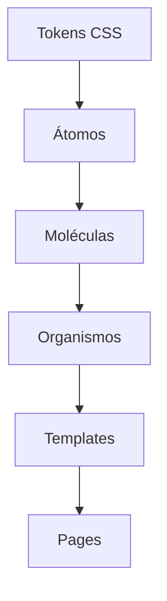

# Guía de Atomic Design - Atomic UI

## Jerarquía de Componentes



| Nivel | Descripción | Ejemplos |
|-------|-------------|----------|
| **Átomos** | Elementos UI básicos e indivisibles | Button, Input, Avatar, Chip |
| **Moléculas** | Combinación de átomos | Select2, Datepicker, Modal |
| **Organismos** | Secciones completas de UI | Sidebar, Topbar, Tabs |
| **Templates** | Layouts estructurales | LayoutShell, AuthLayout |

---

## Sistema de Tokens CSS

### Ubicación de Archivos
```
src/styles/themes/
├── _tokens-primitives.css   # Colores base, escalas
├── _tokens-semantic.css     # Tokens con significado (primary, danger)
├── _tokens-components.css   # Tokens específicos de componentes
└── index.css                # Imports y overrides
```

### Categorías de Tokens

#### 🎨 Colores
```css
/* Usar tokens semánticos, NO colores hex */
color: var(--text-color);              /* ✅ Correcto */
color: var(--primary-color);           /* ✅ Correcto */
color: #793576;                         /* ❌ Incorrecto */

/* Para fondos */
background: var(--surface-background); /* Fondo principal */
background: var(--surface-section);    /* Fondo elevado */
background: var(--surface-elevated);   /* Fondo más elevado */
```

#### 📏 Espaciado
```css
/* Escala de espaciado: 0, 1, 2, 3, 4, 5, 6, 8 */
padding: var(--space-2) var(--space-4);  /* 0.5rem 1rem */
gap: var(--space-3);                      /* 0.75rem */
margin: var(--space-6);                   /* 1.5rem */
```

#### 📐 Border Radius
```css
border-radius: var(--radius-sm);    /* 0.25rem */
border-radius: var(--radius-md);    /* 0.5rem */
border-radius: var(--radius-lg);    /* 0.75rem */
border-radius: var(--radius-full);  /* 9999px (círculo) */
```

#### 🔤 Tipografía
```css
font-size: var(--text-xs);   /* 0.75rem */
font-size: var(--text-sm);   /* 0.875rem */
font-size: var(--text-md);   /* 1rem */
font-size: var(--text-lg);   /* 1.125rem */
font-size: var(--text-xl);   /* 1.25rem */
```

---

## Estructura de un Átomo

```typescript
import { Component, Input, ChangeDetectionStrategy } from '@angular/core';

@Component({
  selector: 'app-[nombre]',
  standalone: true,
  changeDetection: ChangeDetectionStrategy.OnPush,
  template: `...`,
  styles: [`
    /* 1. Estilos base con tokens */
    .elemento {
      padding: var(--space-2) var(--space-4);
      border-radius: var(--radius-md);
      font-size: var(--text-sm);
      color: var(--text-color);
      background: var(--surface-background);
      border: 1px solid var(--border-color);
      transition: all 200ms ease;
    }

    /* 2. Estados interactivos */
    .elemento:hover {
      background: var(--hover-background-subtle);
      border-color: var(--primary-color);
    }

    .elemento:focus {
      outline: none;
      box-shadow: var(--focus-ring);
    }

    /* 3. Variantes de color */
    .elemento-primary { background: var(--primary-color-lighter); color: var(--primary-color); }
    .elemento-success { background: var(--success-color-lighter); color: var(--success-color); }

    /* 4. Variantes de tamaño */
    .elemento-sm { padding: var(--space-1) var(--space-2); font-size: var(--text-xs); }
    .elemento-lg { padding: var(--space-3) var(--space-5); font-size: var(--text-lg); }
  `]
})
export class NombreComponent {
  @Input() variant: 'default' | 'primary' | 'success' = 'default';
  @Input() size: 'sm' | 'md' | 'lg' = 'md';
}
```

---

## Reglas de Tokenización

### ✅ SIEMPRE Tokenizar
| Propiedad | Token |
|-----------|-------|
| Colores de texto | `var(--text-color-*)` |
| Colores de fondo | `var(--surface-*)`, `var(--*-color-lighter)` |
| Bordes | `var(--border-color)`, `var(--*-color)` |
| Espaciado (padding, margin, gap) | `var(--space-*)` |
| Border radius | `var(--radius-*)` |
| Font sizes | `var(--text-*)` |
| Sombras | `var(--shadow-*)` |

### ❌ NUNCA Usar
```css
color: #ffffff;           /* ❌ Usar var(--gray-0) */
color: white;             /* ❌ Usar var(--gray-0) */
background: rgba(0,0,0,0.1); /* ❌ Usar var(--hover-background-subtle) */
padding: 0.5rem;          /* ❌ Usar var(--space-2) */
border-radius: 8px;       /* ❌ Usar var(--radius-md) */
```

### ⚠️ Fallbacks Permitidos
```css
/* Fallbacks para tokens que pueden no existir */
width: var(--avatar-size-md, 2.5rem);
height: var(--checkbox-size, 1.5rem);
```

---

## Manejo de Temas

### Automático vía Tokens Semánticos
```css
/* Los colores cambian automáticamente por tema */
.elemento {
  background: var(--surface-background); /* Blanco en light, oscuro en dark */
  color: var(--text-color);              /* Negro en light, blanco en dark */
}
```

### Cuando Necesitas Override Manual
```css
/* Solo si el tema automático no es suficiente */
:host-context(html.dark) .elemento,
:host-context([data-theme="dark"]) .elemento {
  /* Override específico para modo oscuro */
}
```

---

## Checklist para Nuevos Componentes

- [ ] Usar `ChangeDetectionStrategy.OnPush`
- [ ] Todos los colores usan tokens `var(--*)`
- [ ] Espaciado usa `var(--space-*)`
- [ ] Border radius usa `var(--radius-*)`
- [ ] Font sizes usa `var(--text-*)`
- [ ] Estados hover/focus definidos
- [ ] Sin valores hardcodeados (hex, px, rem sueltos)
- [ ] Accesibilidad: `role`, `aria-*`, `tabindex` donde aplique
