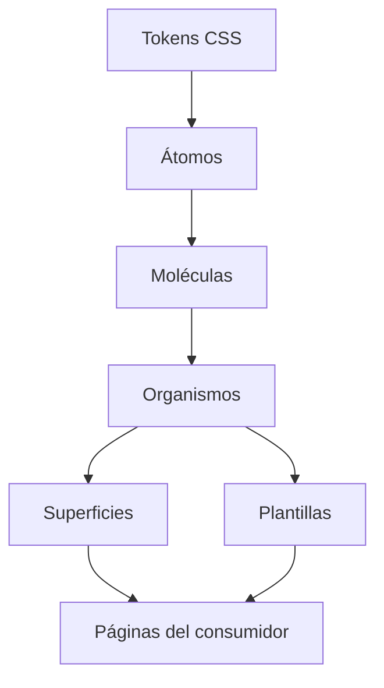

# Guía de diseño atómico de Atomic UI

> Para solicitudes de UI o CRUD dirigidas a agentes, comenzar por el contexto
> compacto y el flujo de `docs/ATOMIC_UI_AGENT_RUNTIME.md`. Esta guía completa
> se usa al crear o modificar el ADN de Atomic, no como contexto predeterminado
> de cada pantalla.

## Jerarquía de componentes



| Nivel | Descripción | Ejemplos |
|-------|-------------|----------|
| **Átomos** | Elementos UI básicos e indivisibles | Button, Input, Avatar, Chip |
| **Moléculas** | Combinación de átomos | Select2, Datepicker, Modal |
| **Organismos** | Secciones completas de UI | Sidebar, Topbar, Tabs |
| **Superficies** | Regiones estructurales gobernadas | Panel |
| **Plantillas** | Layouts estructurales | LayoutShell, AuthLayout |
| **Páginas** | Composición y dominio del consumidor | Rutas funcionales fuera de Atomic |

---

## Sistema de Tokens CSS

### Ubicación de Archivos
```
src/styles/themes/
├── _tokens-primitives.css   # Colores base, escalas
├── _tokens-semantic.css     # Tokens con significado (primary, danger)
├── _tokens-components.css   # Tokens específicos de componentes
└── index.css                # Imports y overrides
```

### Categorías de Tokens

#### 🎨 Colores
```css
/* Usar tokens semánticos, NO colores hex */
color: var(--text-color);              /* ✅ Correcto */
color: var(--primary-color);           /* ✅ Correcto */
color: #793576;                         /* ❌ Incorrecto */

/* Para fondos */
background: var(--surface-background); /* Fondo principal */
background: var(--surface-section);    /* Fondo elevado */
background: var(--surface-elevated);   /* Fondo más elevado */
```

#### 📏 Espaciado
```css
/* Escala de espaciado: 0, 1, 2, 3, 4, 5, 6, 8 */
padding: var(--space-2) var(--space-4);  /* 0.5rem 1rem */
gap: var(--space-3);                      /* 0.75rem */
margin: var(--space-6);                   /* 1.5rem */
```

#### 📐 Border Radius
```css
border-radius: var(--radius-sm);    /* 0.25rem */
border-radius: var(--radius-md);    /* 0.5rem */
border-radius: var(--radius-lg);    /* 0.75rem */
border-radius: var(--radius-full);  /* 9999px (círculo) */
```

#### 🔤 Tipografía
```css
font-size: var(--text-xs);   /* 0.75rem */
font-size: var(--text-sm);   /* 0.875rem */
font-size: var(--text-md);   /* 1rem */
font-size: var(--text-lg);   /* 1.125rem */
font-size: var(--text-xl);   /* 1.25rem */
```

---

## Estructura de un átomo

```typescript
import { ChangeDetectionStrategy, Component, input } from '@angular/core';

@Component({
  selector: 'app-[nombre]',
  standalone: true,
  changeDetection: ChangeDetectionStrategy.OnPush,
  templateUrl: './nombre.component.html',
  styleUrl: './nombre.component.css',
})
export class NombreComponent {
  readonly variant = input<'default' | 'primary' | 'success'>('default');
  readonly size = input<'sm' | 'md' | 'lg'>('md');
}
```

La hoja `nombre.component.css` conserva toda la presentación:

```css
.elemento {
  padding: var(--space-2) var(--space-4);
  border-radius: var(--radius-md);
  font-size: var(--text-sm);
  color: var(--text-color);
  background: var(--surface-background);
  border: 1px solid var(--border-color);
  transition: all 200ms ease;
}

.elemento:hover {
  background: var(--hover-background-subtle);
  border-color: var(--primary-color);
}

.elemento:focus {
  outline: none;
  box-shadow: var(--focus-ring);
}

.elemento-primary { background: var(--primary-color-lighter); color: var(--primary-color); }
.elemento-success { background: var(--success-color-lighter); color: var(--success-color); }
.elemento-sm { padding: var(--space-1) var(--space-2); font-size: var(--text-xs); }
.elemento-lg { padding: var(--space-3) var(--space-5); font-size: var(--text-lg); }
```

---

## Reglas de Tokenización

### ✅ SIEMPRE Tokenizar
| Propiedad | Token |
|-----------|-------|
| Colores de texto | `var(--text-color-*)` |
| Colores de fondo | `var(--surface-*)`, `var(--*-color-lighter)` |
| Bordes | `var(--border-color)`, `var(--*-color)` |
| Espaciado (padding, margin, gap) | `var(--space-*)` |
| Border radius | `var(--radius-*)` |
| Font sizes | `var(--text-*)` |
| Sombras | `var(--shadow-*)` |

### ❌ NUNCA Usar
```css
color: #ffffff;           /* ❌ Usar var(--gray-0) */
color: white;             /* ❌ Usar var(--gray-0) */
background: rgba(0,0,0,0.1); /* ❌ Usar var(--hover-background-subtle) */
padding: 0.5rem;          /* ❌ Usar var(--space-2) */
border-radius: 8px;       /* ❌ Usar var(--radius-md) */
```

### ⚠️ Fallbacks Permitidos
```css
/* Fallbacks para tokens que pueden no existir */
width: var(--avatar-size-md, 2.5rem);
height: var(--checkbox-size, 1.5rem);
```

---

## Manejo de Temas

### Automático vía Tokens Semánticos
```css
/* Los colores cambian automáticamente por tema */
.elemento {
  background: var(--surface-background); /* Blanco en light, oscuro en dark */
  color: var(--text-color);              /* Negro en light, blanco en dark */
}
```

### Cuando Necesitas Override Manual
```css
/* Solo si el tema automático no es suficiente */
:host-context(html.dark) .elemento,
:host-context([data-theme="dark"]) .elemento {
  /* Override específico para modo oscuro */
}
```

---

## Checklist para Nuevos Componentes

- [ ] Usar `ChangeDetectionStrategy.OnPush`
- [ ] Declarar entradas y salidas mediante `input()` y `output()`
- [ ] Referenciar una hoja externa mediante `styleUrl` o `styleUrls`
- [ ] Mantener las propiedades visuales fuera de plantillas y metadatos Angular
- [ ] Todos los colores usan tokens `var(--*)`
- [ ] Espaciado usa `var(--space-*)`
- [ ] Border radius usa `var(--radius-*)`
- [ ] Font sizes usa `var(--text-*)`
- [ ] Estados hover/focus definidos
- [ ] Sin valores hardcodeados (hex, px, rem sueltos)
- [ ] Accesibilidad: `role`, `aria-*`, `tabindex` donde aplique

## Desarrollo local reproducible

| Herramienta | Contrato vigente |
|---|---|
| Node.js | `^22.22.3 || ^24.15.0 || >=26.0.0` |
| npm | Versión incluida con el runtime seleccionado y compatible con `package-lock.json` |
| Angular | 22.1.x, fijado por `package.json` y `package-lock.json` |

La preparación utiliza `npm ci` y `npm run governance:check`; una divergencia
de dependencias se resuelve mediante un cambio explícito de manifiesto y lock.
El ciclo local ejecuta Storybook o `npm start` desde una terminal controlada y
después aplica `npm test -- --watch=false`, `npm run lint` y `npm run build`.
Los procesos interactivos se detienen desde la misma terminal; no se finalizan
globalmente todos los procesos Node del equipo.

Solo existe el template `shell`:

```powershell
npm run create:project -- mi-aplicacion --template=shell
npm run generate:ui -- --spec .\ruta\requisito-ui.json --output .\mi-aplicacion --dry-run
```

La generación no inventa acceso, dashboard, CRUD, credenciales, endpoints, DTO
ni datos simulados. El cierre ejecuta `npm run quality:check`,
`git diff --check` y `git status --short`. Un despliegue o una publicación queda
fuera del desarrollo y requiere autorización, árbol limpio y compuertas de
release.

## Integración gobernada en consumidores

La integración no se realiza mediante copia manual. Primero se ejecuta una
auditoría de solo lectura:

```powershell
npm run governance:install -- D:\ruta\consumidor `
  --ui-root=src/app/shared/ui `
  --audit-only
```

Cuando Angular está bajo `frontend`, se agregan `--package-root=frontend` y
`--ui-root=frontend/src/app/shared/ui`. Toda divergencia se enlaza a un ADR real
y se adopta mediante `--adaptation-decision` y `--change-id`; el instalador no
sobrescribe una adaptación ni crea una justificación genérica.

El consumidor comprueba, desde su raíz, `npm ci`, `npm run check:atomic`, pruebas
y compilación. Rutas, permisos, formularios, endpoints, DTO, HTTP o IPC,
credenciales, sesiones y reglas de negocio permanecen en el consumidor. Atomic
aporta presentación, tokens, variantes, accesibilidad y comportamiento visual.

## Comandos frecuentes y límites

| Categoría | Comandos o acción | Límite |
|---|---|---|
| Calidad | `catalog:check`, `tokens:check`, `governance:check`, `lint`, pruebas y builds | Solo fuentes y artefactos regenerables |
| Interactivo | `storybook`, `start` | Se detiene con `Ctrl+C` en su terminal |
| Generación | `create:project`, `generate:ui --dry-run` | Se revisa antes de escribir |
| Externo | despliegue, publicación, versión o sobrescritura | Requiere autorización explícita |

Si un proceso queda huérfano, se identifica por PID y directorio de trabajo. No
se utiliza una orden global contra todos los procesos Node. No se eliminan locks
ni dependencias para forzar una compilación.
