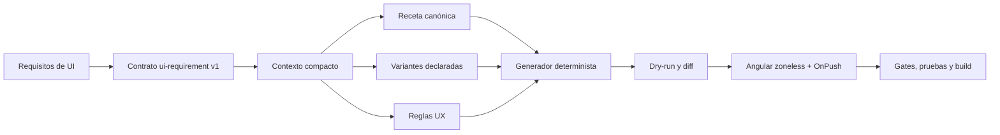

# Atomic UI: runtime de diseño para agentes

## Resultado esperado

Atomic no es solo una colección de componentes. Es un sistema capaz de recibir
requisitos funcionales, seleccionar una receta, aplicar variantes y reglas UX
canónicas, generar una base Angular segura y demostrar por qué esa salida es
válida.



## Jerarquía de autoridad

1. Los requisitos funcionales y contratos del backend definen la verdad de
   dominio.
2. El código de Atomic define la API visual que realmente puede ejecutarse.
3. `catalog/components` hace esa API consultable y declara sus variantes.
4. `catalog/ux-rules` conserva el ADN UX transversal.
5. `catalog/recipes` define composiciones, no lógica de negocio.
6. `.agents/skills/atomic-ui-builder` convierte el sistema en un procedimiento
   corto y repetible para agentes.

Un documento inferior nunca puede inventar ni contradecir una autoridad
superior.

## Variantes como contrato

Una variante existe solo cuando está implementada y catalogada. Sus ejes se
mantienen independientes para evitar nombres combinatorios como
`primary-small-compact-danger`:

| Eje       | Decide                   | Ejemplos                        |
| --------- | ------------------------ | ------------------------------- |
| `variant` | jerarquía o forma visual | primary, outline, soft          |
| `tone`    | significado semántico    | neutral, danger, success        |
| `size`    | escala del control       | sm, md, lg                      |
| `density` | volumen de información   | comfortable, compact            |
| `layout`  | adaptación espacial      | auto, inline, stacked           |
| `state`   | condición observable     | loading, empty, error, disabled |

El valor predeterminado es la ruta canónica. Un agente solo elige otro valor si
el requisito aporta una razón semántica o espacial verificable.

## Recetas iniciales

| Intención               | Receta          | Uso                                              |
| ----------------------- | --------------- | ------------------------------------------------ |
| Catálogo simple         | `modal-catalog` | lista, búsqueda y alta/edición breve en diálogo  |
| Formulario extenso      | `route-form`    | edición que necesita una ruta y contexto propios |
| Exploración relacionada | `master-detail` | selección maestra con detalle dependiente        |

`PageHeader`, `QueryToolbar`, `DataTable`, `FormDialog`, `DataState` y los grupos
de acciones resuelven la estructura visual repetida observada en Front Atomic.
El consumidor conserva permisos, rutas, formularios tipados, fachadas, DTO,
HTTP y reglas de negocio.

En un `FormDialog`, el cierre visual canónico es una única X superior con
etiqueta accesible específica, dentro de un control cuadrado y centrado respecto
del encabezado. El encabezado permanece visible durante el
desplazamiento. El pie contiene `Cancelar` solo cuando hay datos por descartar,
además de la acción principal; un diálogo informativo no repite `Cerrar` abajo.

## Modos de generación

- `ui-only`: crea puertos y estados explícitos sin fingir datos ni llamadas de
  red. Es el modo seguro cuando el backend todavía no está definido.
- `integrated`: requiere endpoint, método y contrato de datos explícitos. Si
  falta cualquiera, la generación se rechaza. Incluso en este modo Atomic
  conserva la integración detrás de un puerto: publica los metadatos HTTP pero
  no inventa DTO, mapeos, forma física de paginación ni URL base.

El borrado solo se genera cuando `actions[]` declara etiqueta, ubicación,
`permissionKey` y todos los textos de confirmación. El puerto de permisos
deniega por defecto; el consumidor debe conectarlo a su autorización real.

El generador siempre se ejecuta primero con `--dry-run`, no sobrescribe archivos
existentes y produce el mismo resultado para el mismo contrato.

## Flujo operativo

```powershell
npm run agent:context -- --intent crud --variant modal-catalog
npm run generate:ui -- --spec test-fixtures/ui-requirements/modal-catalog-ui-only.json --output ..\consumer --dry-run
npm run generate:ui -- --spec test-fixtures/ui-requirements/modal-catalog-ui-only.json --output ..\consumer
npm run catalog:check
npm run tokens:check
npm run tooling:test
```

Después se ejecutan lint, pruebas Angular y build según el alcance. El contexto
compacto debe ser la primera consulta; los manuales completos se reservan para
una extensión del sistema o una ambigüedad no resuelta por el catálogo.

## Definición de terminado

- No hay componentes, valores, endpoints, permisos ni datos inventados.
- Todas las variantes existen en código y catálogo.
- Hay una sola acción primaria por región y las destructivas son explícitas.
- Carga, vacío, error, éxito e interacción bloqueada están cubiertos cuando
  aplican.
- Formularios, foco, teclado y mensajes de validación cumplen las reglas UX.
- La composición funciona en 320, 375, 768 y 1366 CSS px sin doble scroll.
- El dry-run es revisable, la generación es determinista y no sobrescribe.
- Catálogo, tokens, tooling, lint, pruebas, aplicación y Storybook aplicables
  terminan en verde.
