# 📋 Walkthrough: Auditoría y Mejoras del Sistema de Temas

**Fecha**: Diciembre 2025  
**Proyecto**: Atomic UI - Sistema de Temas  
**Build verificado**: ✅ Exitoso

---

## 🎯 Objetivos Completados

1. Auditoría profunda del sistema de temas
2. Identificación de 8 problemas principales
3. Implementación de correcciones en 4 fases
4. Verificación de build exitosa

---

## 🔍 Problemas Identificados

| # | Problema | Severidad | Estado |
|---|----------|-----------|--------|
| 1 | Variable `--gray-950` duplicada | 🔴 Alta | ✅ Corregido |
| 2 | Colores hardcodeados en tokens semánticos | ⚠️ Media | ✅ Refactorizado |
| 3 | Tokens hover faltantes | ⚠️ Media | ✅ Agregados |
| 4 | Token `--text-color-disabled` faltante | ⚠️ Media | ✅ Agregado |
| 5 | Token `--surface-hover` no definido | ⚠️ Media | ✅ Agregado |
| 6 | Uso excesivo de `:host-context()` | ⚠️ Media | ✅ Simplificado |
| 7 | Fallbacks hardcodeados en componentes | 🟡 Baja | ✅ Limpiados |
| 8 | Escala de control-height incompleta | 🟡 Baja | ✅ Agregada |

---

## 📁 Archivos Modificados

### Tokens Primitivos
#### [_tokens-primitives.css](file:///f:/Front-dinamic/-Atomic-UI/src/styles/themes/_tokens-primitives.css)

render_diffs(file:///f:/Front-dinamic/-Atomic-UI/src/styles/themes/_tokens-primitives.css)

**Cambios:**
- Eliminada variable duplicada `--gray-950`
- Agregado `--gray-75` para surface-ground (iOS Light Gray)
- Agregados colores iOS System (`--ios-green`, `--ios-red`, `--ios-orange`, `--ios-blue` y variantes dark)
- Agregada escala completa de control-height (`xs`, `sm`, `md`, `lg`)

---

### Tokens Semánticos
#### [_tokens-semantic.css](file:///f:/Front-dinamic/-Atomic-UI/src/styles/themes/_tokens-semantic.css)

**Cambios para Tema Claro:**
- `--surface-ground` ahora deriva de `var(--gray-75)`
- Colores de estado (success, warning, danger, info) derivados de tokens iOS primitivos
- Agregados tokens hover para cada estado (`--success-color-hover`, etc.)
- Agregado `--text-color-disabled`
- Agregado `--surface-hover`
- Interacciones ahora usan `var(--primary-color-lighter)` en lugar de hex

**Cambios para Temas Oscuros (brand-dark y dark):**
- Colores de estado derivados de tokens iOS dark (`--ios-green-dark`, etc.)
- Agregados tokens hover para cada estado
- Agregado `--text-color-disabled`
- Agregado `--surface-hover`

---

### Tokens de Componentes
#### [_tokens-components.css](file:///f:/Front-dinamic/-Atomic-UI/src/styles/themes/_tokens-components.css)

```diff
-   --control-height: 2.875rem;
+   --control-height: var(--control-height-md);
```

---

### Estilos de Botones
#### [_buttons.css](file:///f:/Front-dinamic/-Atomic-UI/src/styles/themes/_buttons.css)

```diff
- background-color: var(--success-color-hover, #059669);
+ background-color: var(--success-color-hover);
```

Eliminados fallbacks hardcodeados ahora que los tokens están definidos.

---

### Componentes Refactorizados

#### [table-actions.component.css](file:///f:/Front-dinamic/-Atomic-UI/src/app/shared/ui/molecules/table-actions/table-actions.component.css)

Eliminados 20 líneas de `:host-context()` overrides para dark mode.  
Ahora los tokens semánticos manejan automáticamente los cambios de tema.

#### [topbar.component.css](file:///f:/Front-dinamic/-Atomic-UI/src/app/shared/ui/organisms/topbar/topbar.component.css)

```diff
- background: var(--surface-hover, #f3f4f6);
+ background: var(--surface-hover);
```

Eliminados fallbacks ahora que `--surface-hover` está definido.

#### [datepicker.component.css](file:///f:/Front-dinamic/-Atomic-UI/src/app/shared/ui/molecules/datepicker/datepicker.component.css)

```diff
- color: var(--text-color-disabled, #d1d5db);
+ color: var(--text-color-disabled);
```

---

## 📊 Métricas de Mejora

| Métrica | Antes | Después |
|---------|-------|---------|
| Variables duplicadas | 1 | 0 |
| Tokens faltantes referenciados | 5 | 0 |
| `:host-context()` en table-actions | 20 líneas | 0 líneas |
| Fallbacks hardcodeados en topbar | 6 | 0 |
| Escalas de control-height | 1 | 4 |
| Tokens iOS agregados | 0 | 8 |

---

## 🏗️ Nueva Arquitectura de Tokens

```mermaid
flowchart TB
    subgraph PRIMITIVOS["🎨 TOKENS PRIMITIVOS (_tokens-primitives.css)"]
        direction TB
        
        subgraph Grises["Escala de Grises"]
            G0["--gray-0<br/>#FFFFFF"]
            G50["--gray-50<br/>#F9FAFB"]
            G75["--gray-75 ✨<br/>#efeff4"]
            G100["--gray-100<br/>#F3F4F6"]
            G900["--gray-900<br/>#111827"]
        end
        
        subgraph iOS["Colores iOS System ✨"]
            IOS_G["--ios-green<br/>#34C759"]
            IOS_GD["--ios-green-dark<br/>#30D158"]
            IOS_O["--ios-orange<br/>#FF9500"]
            IOS_R["--ios-red<br/>#FF3B30"]
            IOS_B["--ios-blue<br/>#007AFF"]
        end
        
        subgraph Heights["Control Heights ✨"]
            H_XS["--control-height-xs<br/>24px"]
            H_SM["--control-height-sm<br/>32px"]
            H_MD["--control-height-md<br/>46px"]
            H_LG["--control-height-lg<br/>56px"]
        end
        
        subgraph Colores["Colores Base"]
            RED["--red-50 a --red-900"]
            GREEN["--green-50 a --green-900"]
            BLUE["--blue-50 a --blue-900"]
        end
    end
    
    subgraph BRAND["🏢 TOKENS DE MARCA (_tokens-brand.css)"]
        direction LR
        BP["--brand-primary-50 a 900<br/>Púrpura #5F295C"]
        BS["--brand-secondary-50 a 900<br/>Dorado #FFB800"]
        BA["--brand-accent-50 a 900<br/>Rosa #f5368a"]
    end
    
    subgraph SEMANTIC["🌓 TOKENS SEMÁNTICOS (_tokens-semantic.css)"]
        direction TB
        
        subgraph Superficies["Superficies"]
            SG["--surface-ground"]
            SB["--surface-background"]
            SH["--surface-hover ✨"]
        end
        
        subgraph Estados["Estados Semánticos"]
            SC["--success-color"]
            SCH["--success-color-hover ✨"]
            WC["--warning-color"]
            WCH["--warning-color-hover ✨"]
            DC["--danger-color"]
            DCH["--danger-color-hover ✨"]
        end
        
        subgraph Texto["Texto"]
            TC["--text-color"]
            TCS["--text-color-secondary"]
            TCD["--text-color-disabled ✨"]
        end
        
        subgraph Interacciones["Interacciones"]
            HB["--hover-background"]
            FR["--focus-ring"]
        end
    end
    
    subgraph COMPONENTS["🧩 TOKENS COMPONENTES (_tokens-components.css)"]
        direction LR
        CH["--control-height"]
        IB["--input-bg, --input-border"]
        BB["--button-primary-bg"]
        TB["--table-bg, --table-header-bg"]
    end
    
    %% Conexiones Primitivos → Semánticos
    G75 -->|"deriva"| SG
    G100 -->|"deriva"| SH
    IOS_G -->|"Light"| SC
    IOS_GD -->|"Dark"| SC
    GREEN -->|"hover"| SCH
    IOS_O -->|"Light"| WC
    IOS_R -->|"Light"| DC
    RED -->|"hover"| DCH
    G900 -->|"Light"| TC
    G400 -->|"deriva"| TCD
    
    %% Conexiones Brand → Semánticos
    BP -->|"deriva"| HB
    BP -->|"deriva"| FR
    
    %% Conexiones Semánticos → Componentes
    H_MD -->|"deriva"| CH
    SB -->|"deriva"| IB
    SC -->|"deriva"| BB
    
    %% Estilos
    classDef nuevo fill:#d4edda,stroke:#28a745,stroke-width:2px
    class G75,IOS_G,IOS_GD,IOS_O,IOS_R,IOS_B,H_XS,H_SM,H_MD,H_LG,SH,SCH,WCH,DCH,TCD nuevo
```



### Leyenda
- ✨ = Token nuevo agregado en esta auditoría
- Las flechas muestran cómo los tokens derivan unos de otros
- Los tokens verdes resaltados son los nuevos agregados

---

## ✅ Verificación

### Build de Producción
```
Application bundle generation complete. [9.944 seconds]
Exit code: 0
```

### Archivos de Output
- Browser bundles: 583.95 kB (130.95 kB transferido)
- Styles: 178.14 kB (29.25 kB comprimido)

---

## 📝 Recomendaciones Futuras

1. **Focus Ring Dinámico**: Considerar `color-mix()` cuando la base de usuarios tenga navegadores post-2023
2. **Simplificar `:host-context()`**: Continuar eliminando en `panel.component.css` y `filters.component.css`
3. **Documentar Tokens**: Actualizar README.md con los nuevos tokens disponibles

---

## 🎨 Tokens Nuevos Disponibles

Para uso en componentes:

```css
/* Control heights */
--control-height-xs: 1.5rem;   /* 24px */
--control-height-sm: 2rem;     /* 32px */
--control-height-md: 2.875rem; /* 46px (default) */
--control-height-lg: 3.5rem;   /* 56px */

/* Colores hover de estado */
--success-color-hover
--warning-color-hover
--danger-color-hover
--info-color-hover

/* Superficies adicionales */
--surface-hover

/* Texto */
--text-color-disabled
```
